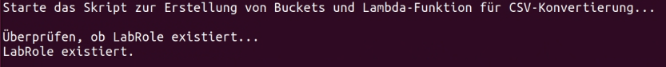
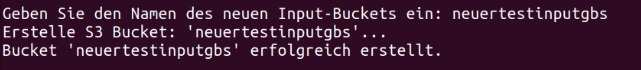
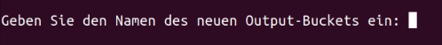
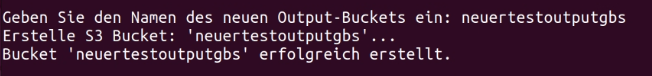
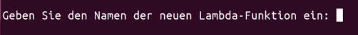
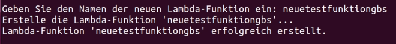
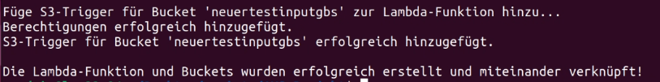
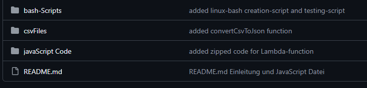

# Inhaltsverzeichnis
- Installationsanleitung
Erklärt wie Man vorgehen muss um das Script auszuführen.
- Einleitung
Erklärt die Ziele des Projektes und wie wir unsere Gruppe aufgeteilt haben.
- Repository Aufbau
Hier wird der Aufbau des Repository erklärt.
- Erstellung des Projekts
Erklärt den verwendeten Code.
- Tests
Hier findet Man die Tests welche wir durchgeführt haben.
- Reflexion
Unsere Reflexionen zum Projekt.
# - Installationsanleitung -
## Dateien Installieren
---
Auf [GitHub](https://github.com/InteruniversalBuddy/M346_Projekt/tree/main) findet Man im Code Register unter "About" einen Release.
Auf diesem kann Man die benötigten Dateien für die Installation herunterladen.
![[Release_location.png]]

Für die Installation werden die ersten drei Dateien benötigt ([AWSProject-creationScript-Streule-Oviol-Muriqi.sh](https://github.com/InteruniversalBuddy/M346_Projekt/releases/download/untagged-537ab10d1be501f617cb/AWSProject-creationScript-Streule-Oviol-Muriqi.sh), [AWSProject-testScript-Streule-Oviol-Muriqi.sh](https://github.com/InteruniversalBuddy/M346_Projekt/releases/download/untagged-537ab10d1be501f617cb/AWSProject-testScript-Streule-Oviol-Muriqi.sh), [awsProjectLambdaCode.zip](https://github.com/InteruniversalBuddy/M346_Projekt/releases/download/untagged-537ab10d1be501f617cb/awsProjectLambdaCode.zip)).

|      Datei      |                          Zweck                          |
| :-------------: | :-----------------------------------------------------: |
| Creation Script |       Skript zur Erstellung der AWS-Infrastruktur       |
|   Test Script   | Eine ZIP-Datei mit dem Code für die AWS-Lambda-Funktion |
|   Lambda Code   |    Zum Testen der Infrastruktur nach der Erstellung     |
![[Installations_Dateien.png]]
## Dateien hochladen
---
Diese Dateien lädt Man auf eine Linux-VM (z.B. Ubuntu).
(Die ZIP-Datei verschlossen lassen!)
Alle Dateien müssen im gleichen Ordner sein.
## Script ausführen
---
Jetzt führt Man die ([AWSProject-creationScript-Streule-Oviol-Muriqi.sh](https://github.com/InteruniversalBuddy/M346_Projekt/releases/download/untagged-537ab10d1be501f617cb/AWSProject-creationScript-Streule-Oviol-Muriqi.sh) Datei aus und eine Konsole sollte sich so öffnen.

Hier wählt man einen beibiegen Namen für den Input-Bucket, welcher eindeutig sein muss.

Falls sie einen eindeutigen Namen gewählt haben, sollte es so aussehen:

Danach machen Sie das Gleiche für den Output-Bucket.


Danach wählen Sie auch einen Namen für die Lambda Funktion, dieser muss auch eindeutig sein.

Falls sie einen eindeutigen Namen gewählt haben, sollte es so aussehen:

Der Trigger (im Input-Bucket) wird hinzugefügt.
Falls alles funktioniert hat, sollte dies die finale Ausgabe sein:

# - Repository Aufbau -


|     Ordner      |                       Erklärung                        |
| :-------------: | :----------------------------------------------------: |
| javaScript Code | Hier befinden sich die Dateien für die Lambda Funktion |
|    csvFiles     |                   Dateien zum Testen                   |
|  bash-Scripts   |   Hier befinden sich die Hauptdateien zum ausführen    |
# - Einleitung -
## Ziele
---
1. Mittels zwei [AWS](https://awsacademy.instructure.com/) S3-Buckets (In & Out) und einer [AWS](https://awsacademy.instructure.com/) Lambda-Funktion, die CSV-Datei(en) automatisch zu einer JSON-Datei konvertiert und speichert.
2. Dies soll durch Ausführung eines Scripts, welches auf einem Linux-Client im [AWS](https://awsacademy.instructure.com/) Learner-Lab in Betrieb genommen werden kann, geschehen.
3.  Alle benötigte Dateien und die Dokumentation wird in einem Git-Repository abgelegt.
4. Die Dokumentation wird in einer Markdown Datei geschrieben und zeigt den Aufbau des services & die Inbetriebnahme + Verwendung.
5. Der Service wird getestet und die Testfälle werden alle Dokumentiert (via Screenshots).
## Gruppenaufteilung
---
### Jaris Streule
#### Hauptaufgabe
- Erstellung der Funktionalität.
#### Aufgaben Checkliste
- [x] Erstellt die erste Version des JavaScript-Code für die Konvertierung von CSV zu JSON (In lokalem NodeJS).
- [x] Erstellt die Lambda Funktion zusammen mit dem JavaScript Code.
- [x] Erstellt das Script zum testen der Infrastruktur.
- [x] Reflexion schreiben.
### Alexander Oviol Martinez
#### Hauptaufgabe
- Scripts für die Infrastruktur erstellen.
#### Aufgaben Checkliste
- [x] Lernt wie man automatisch Buckets erstellen kann, welche für die Lambda Funktion verwendet werden.
- [x] Erstellt das Script zum automatischen erstellen von Buckets.
- [x] Erweiter das Script mit automatischer Erstellung der (von Jaris erstellten) Lamda-Funktion.
- [x] Reflexion schreiben.
### Arion Muriqi
#### Hauptaufgabe
- Dokumentation des ganzen Projektes.
#### Aufgaben Checkliste
- [x] Erstellt das GitHub-Repository.
- [x] Schreibt die ganze Dokumentation.
- [x] Reflexion schreiben.

# - Erstellung des Projekts -
## Erste Versionen
---
### Convert CSV to JSON (JavaScript)
Zuerst wird der Pfad definiert, in welchem sich die Input (CSV) & Output (JSON) Datei befindet.
```js
const fs = require("fs");

const csvPath = "../../csvFiles/testCSV1.csv";
```

Danach wird eine Funktion erstellt um CSV zu JSON konvertieren.
```js
function csvToJson(csvFilePath, jsonFilePath) {
```

Zuerst wird geschaut ob die gegebene CSV Datei, ausgelesen werden kann.
```js
if (err) {
    console.error("Error reading CSV file:", err);
    return;
}
```

Als nächstes werden die Regeln für den Header und die Trennung der Werte definiert.
```js
const rows = data.split("\n");

const headers = rows[0].split(";");

const result = rows.slice(1).map((row) => {
    const values = row.split(";");
    let obj = {};
```

Zum Schluss werden die Daten ausgelesen und von der Funktion zurückgegeben.
```js
			return obj;
        });

        fs.writeFile(jsonFilePath, JSON.stringify(result, null, 2), "utf-8", (err) => {
            if (err) {
                console.error("Error writing JSON file:", err);
                return;
            }
        });
    });
}
```

Dann wird die CSV Datei gelesen und die Funktion mit den richtigen Parametern ausgeführt.
```js
const csvData = fs.readFileSync(csvPath, "utf8");
csvToJson(csvPath, "../../csvFiles/testJSON.JSON");
```

### Bucket Erstellung (Bash)
Zuerst wird eine Funktion zur Erstellung des Buckets geschrieben.
Es wird zuerst ein Name für den Bucket gewählt und geschaut das dieser Name keine Fehler gibt.
Je nachdem ob es funktioniert hat oder nicht wird dann eine Nachricht ausgegeben.
```bash
# Funktion zur Erstellung eines Buckets mit Fehlerausgabe
create_bucket() {
    local bucket_name=$1
    echo "Versuche, den Bucket $bucket_name zu erstellen..."
    
    # Führt das AWS-Kommando aus und erfasst Fehlerausgabe
    aws s3api create-bucket --bucket "$bucket_name" 2>&1 &
    
    local cmd_pid=$! # Speichert die Prozess-ID des aws-Kommandos
    loading_animation $cmd_pid # Startet die Ladeanimation

    # Prüfen, ob das Kommando erfolgreich war
    if wait $cmd_pid; then
        echo "Bucket $bucket_name wurde erfolgreich erstellt."
        return 0
    else
        echo "Fehler: Der Bucket-Name $bucket_name konnte nicht erstellt werden."
        return 1
    fi
}
```

Jetzt wird der Benutzer gefragt, einen Namen für den Bucket zu wählen, falls es funktioniert, wird die Schleife beendet, ansonsten versucht 
```bash
# Hauptprogramm: Bucket-Namen abfragen und erstellen
while true; do
    # Benutzer nach einem Bucket-Namen fragen
    read -p "Bitte geben Sie einen eindeutigen Bucket-Namen ein: " BUCKET_NAME

    # Bucket erstellen und prüfen, ob es funktioniert hat
    if create_bucket "$BUCKET_NAME"; then
        break # Bucket erfolgreich erstellt, Schleife verlassen
    else
        echo "Bitte wählen Sie einen anderen Bucket-Namen."
    fi
done
```

## Finale Version
---
### Creation Script

Zuerst werden alle Variablen erstellt welche benötigt werden.
Zunächst wird eine Funktion erstellt die testet ob LabRole, bei dem Benutzer existiert.
```bash
#!/bin/bash

# Version vom 20.12.2024
# Autor: Alexander Oviol Martinez / Jaris Streule 
# Zweck: Dieses Skript erstellt zusammen mit der richtigen Zip-Datei eine AWS Bucket- und Lambda-Infrastruktur um CSV-Dateien zu JSON-Dateien zu konvertieren.

# Variablen
LAMBDA_ZIP_FILE="awsProjectLambdaCode.zip"  # Name der ZIP-Datei mit dem JavaScript-Code fuer die Lambda-Funktion

INPUT_BUCKET="" # speichern von User-Input
OUTPUT_BUCKET="" # speichern von User-Input
LAMBDA_FUNCTION_NAME="" # speichern von User-Input
ACCOUNT_ID=$(aws sts get-caller-identity --query "Account" --output text) 
LABROLE="arn:aws:iam::$ACCOUNT_ID:role/LabRole" # Die ARN der LabRole aus 'ACCOUNT_ID' und anderen Parametern

# checken ob die LabRole fuer den User existiert (wird benoetigt)
check_lab_role() {
    echo -e "\nÜberprüfen, ob LabRole existiert..."
    if aws iam get-role --role-name LabRole >/dev/null; then
        echo "LabRole existiert."
        return 0
    else
        echo -e "\nFehler: LabRole wurde nicht gefunden - bitte Credentials überprüfen"
        exit 1
    fi
}
```

Danach wird eine Funktion erstellt um die beiden S3 Buckets zu erstellen.
```bash
# wiederverwendbare Funktion um S3 Buckets zu erstellen
create_bucket() {
    local bucket_name=$1 # Parameter fuer den Bucket-Namen
    echo "Erstelle S3 Bucket: '$bucket_name'..."
    aws s3api create-bucket --bucket "$bucket_name" >/dev/null
    # Checken ob es einen Fehler seitens AWS gegeben hat
    if [ $? -eq 0 ]; then
        echo "Bucket '$bucket_name' erfolgreich erstellt."
        return 0
    else
        echo -e "\nFehler: beim Erstellen des Buckets '$bucket_name' gab es ein Problem."
        exit 1
    fi
}
```

Als nächstes wird eine Funktion erstellt, welche die Lambda-Funktion erstellt.
Zuerst wird die ZIP-Datei gesucht, welche dafür verwendet wird.
Danach wird die Lambda-Funktion mit allen Parametern erstellt und direkt geprüft ob es von AWS einen Fehler gegeben hat.
```bash
# Lambda-Funktion erstellen
create_lambda_function() {
    echo "Erstelle die Lambda-Funktion '$LAMBDA_FUNCTION_NAME'..."
    # checken ob die ZIP-Datei mit dem Code fuer die Lambda-Funktion existiert
    if [ ! -f "$LAMBDA_ZIP_FILE" ]; then
        echo -e "\nFehler: Die Datei '$LAMBDA_ZIP_FILE' wurde nicht gefunden!"
        exit 1
    fi

    aws lambda create-function \
        --function-name $LAMBDA_FUNCTION_NAME \
        --runtime nodejs18.x \
        --role $LABROLE \
        --handler index.handler \
        --environment "Variables={INPUT_BUCKET_NAME= $INPUT_BUCKET,OUTPUT_BUCKET_NAME= $OUTPUT_BUCKET}" \
        --zip-file fileb://$LAMBDA_ZIP_FILE \
         >/dev/null
    # Checken ob es einen Fehler seitens AWS gegeben hat
    if [ $? -eq 0 ]; then
        echo "Lambda-Funktion '$LAMBDA_FUNCTION_NAME' erfolgreich erstellt."
        return 0
    else
        echo -e "\nFehler: bei der Erstellung der Lambda-Funktion gab es ein Problem."
        exit 1
    fi
}
```

Zunächst wird eine Funktion erstellt welche den Trigger für den Input-Bucket auf der Lambda-Funktion setzt.
Zuerst wird die Lamda-Funktion erstellt und danach getestet ob ein Fehler dabei aufgetreten ist.
Dann wird der Lambda-Funktion der Trigger hinzugefügt und noch geschaut ob auf der AWS ein Fehler aufgetreten ist.
```bash
# Trigger auf den Input-Bucket hinzufuegen fuer die Lambda-Funktion
add_s3_trigger() {
    local bucket_name=$1 # Parameter fuer den Bucket-Namen
    echo -e "\nFüge S3-Trigger für Bucket '$bucket_name' zur Lambda-Funktion hinzu..."
    
    # Dynamisch die Lambda-ARN zusammensetzen aus der ACCOUNT_ID und dem Namen der Lambda-Funktion
    LAMBDA_ARN="arn:aws:lambda:$(aws configure get region):$ACCOUNT_ID:function:$LAMBDA_FUNCTION_NAME"
    # der Lambda-Funktion Berechtigungen hinzufuegen fuer Zugriff auf Input-Bucket  
    aws lambda add-permission \
        --function-name $LAMBDA_FUNCTION_NAME \
        --action lambda:InvokeFunction \
        --principal s3.amazonaws.com \
        --source-arn arn:aws:s3:::$bucket_name \
        --statement-id S3TriggerPermission \
        >/dev/null
    # Checken ob es einen Fehler seitens AWS gegeben hat
    if [ $? -eq 0 ]; then
        echo "Berechtigungen erfolgreich hinzugefügt."
    else
        echo -e "\nFehler: beim hinzufügen der Berechtigungen gab es ein Problem."
        exit 1
    fi
    # der Lambda-Funktion den Trigger hinzufuegen
    aws s3api put-bucket-notification-configuration \
        --bucket $bucket_name \
        --notification-configuration '{
            "LambdaFunctionConfigurations": [
                {
                    "LambdaFunctionArn": "'$LAMBDA_ARN'",
                    "Events": ["s3:ObjectCreated:*"]
                }
            ]
        }' \
        >/dev/null
    # Checken ob es einen Fehler seitens AWS gegeben hat
    if [ $? -eq 0 ]; then
        echo "S3-Trigger für Bucket '$bucket_name' erfolgreich hinzugefügt."
        return 0
    else
        echo -e "\nFehler: beim hinzufügen des S3-Triggers gab es ein Problem."
        exit 1
    fi
}
```

Zum Schluss werden dann Alle Funktionen in der richtigen Reihenfolge ausgeführt.
```bash
# Hauptprogramm
echo "Starte das Skript zur Erstellung von Buckets und Lambda-Funktion für CSV-Konvertierung..."

# LabRole checken
check_lab_role

# Erstellen der Buckets
echo -e "\n"
read -p "Geben Sie den Namen des neuen Input-Buckets ein: " INPUT_BUCKET
create_bucket "$INPUT_BUCKET"

echo -e "\n"
read -p "Geben Sie den Namen des neuen Output-Buckets ein: " OUTPUT_BUCKET
create_bucket "$OUTPUT_BUCKET"

# Lambda-Funktion erstellen
echo -e "\n"
read -p "Geben Sie den Namen der neuen Lambda-Funktion ein: " LAMBDA_FUNCTION_NAME
if create_lambda_function; then
    # Trigger nur fuer den Input-Bucket hinzufuegen
    add_s3_trigger "$INPUT_BUCKET"
    echo -e "\nDie Lambda-Funktion und Buckets wurden erfolgreich erstellt und miteinander verknüpft!"
    exit 0
fi
```

## Aufbau der Lambda-Funktion
---
### Index Datei
Wenn der Trigger im Input-Bucket ausgelöst wird, wird die Index.mjs Datei in der ZIP-Datei aufgerufen.
In diesem Script befindet sich ein Handler (dieser wird direkt ausgeführt, ohne aufgerufen zu werden).

Zuerst werden alle nötigen Sachen importiert, welche der Code braucht und Variablen erstellt.
```js
// Zweck: Dieses Skript enthaelt den haupt-Code fuer eine AWS-Lambda-Funktion um CSV-Dateien von einem AWS-S3-Bucket zu JSON-Dateien in einem anderen AWS-S3-Bucket zu konvertieren.
// Abhaengigkeiten: toJson-Skript (neben-Skript fuer die eigentliche Konvertierung)
import { S3 } from '@aws-sdk/client-s3'; 
import { toJson } from './toJson.mjs';
// Variablen
const s3 = new S3();
let bucketNameFromClient;

bucketNameFromClient = process.env.INPUT_BUCKET_NAME; //Umgebungsvariable mit dem Input-Bucket Name, welche im Client-Skript definiert wurde
```

Danach wird der Handler erstellt.
Dann wird der Bucket-Name geholt und überprüft das es übereinstimmt mit dem Importierten Bucket.
```js
export const handler = async (event) => {
    console.log('Received event:', JSON.stringify(event, null, 2));

    // Get Name des Buckets welcher den Trigger ausgeloest hat
    const bucket = event.Records[0].s3.bucket.name;

    // nochmals checken ob das wirklich der richtige Bucket ist
    if (bucket !== bucketNameFromClient) {
	console.log("trigger was triggered by wrong bucket");
        console.log("bucket name:", bucket);
        console.log("expected name:", bucketNameFromClient);
        return;
    }
```

Zum Schluss werden die letzten Parameter gesetzt und alles ausgeführt.
Hier wird auch die (unten erklärte) Datei ausgeführt welche wir vorhin importiert haben, um die JSON Datei zu CSV konvertieren.
```js
const key = decodeURIComponent(event.Records[0].s3.object.key.replace(/\+/g, ' ')); // Dateipfad bzw. Name der neu hochgeladenen Datei zusammensetzen
    const params = {
        Bucket: bucket,
        Key: key,
    };
    try {
        console.log("newUpload");
        const { ContentType } = await s3.getObject(params);
        console.log('CONTENT TYPE:', ContentType);
        await toJson(bucket, key); // toJson-Funktion aus toJson-Skript ausfuehren um Datei zu Konvertieren und in einem neuen Bucket zu speichern
        return ContentType;
    } catch (err) {
        console.log(err);
        const message = `Error getting object ${key} from bucket ${bucket}. Make sure they exist and your bucket is in the same region as this function.`;
        console.log(message);
        throw new Error(message);
    }
};
```

### Convert CSV to JSON
In dieser Datei wird eine Funktion erstellt um die JSON-Datei zu einer CSV abzuändern.
Dazu wird der Out-Bucket verwendet, um das Resultat zu speichern.

Zuerst wird alles importiert und alle Variablen gesetzt.

Darin wird eine Funktion erstellt welche die Konvertierung durchführt.
Als erstes wird die CSV Datei ausgelesen.
Dann wird die Trennung definiert und auch festgelegt das die erste Reihe ein Header (Kopfzeile) ist.
Die Daten werden dann korrekt auseinander genommen und wieder in einem JSON format zusammengebaut.
Zum Schluss wird alles dann in eine JSON-Datei gespeichert.
```js
		 // CSV-Datei zu JSON konvertieren 
        const csvToJson = (csvFilePath, jsonFilePath) => {
            return new Promise((resolve, reject) => {
                // die CSV-Datei auslesen mit Callback-Funktion wobei 'data' jetzt die CSV-Daten sind 
                fs.readFile(csvFilePath, "utf-8", (err, data) => {
                    if (err) {
                        reject("Error reading CSV file:", err);
                        return;
                    }

                    // CSV-Data nach jedem Zeilenumbruch seperieren und alle leeren Zeilen raus filtern
                    const rows = data.split("\n").filter(row => row.trim() !== "");

                    // der erste Eintrag im 'rows'-Array bzw. die erste Zeile der CSV-Data sind die Ueberschriften. Ueberschriften werden in einem neuen Array gespeichert wobei sie wieder seperiert werden.
                    const headers = rows[0].split(delimiterZeichen );

                    // verbleibende Zeilen werden zu Objekten
                    const result = rows.slice(1).map((row) => {
                        const values = row.split(delimiterZeichen );
                        let obj = {};
			// jeder Ueberschrift werden die richtigen Werte zugeordnet
                        headers.forEach((header, index) => {
                            obj[header.trim()] = values[index] ? values[index].trim() : "";
                        });

                        return obj;
                    });

                    // Resultat wird in eine JSON-Datei geschrieben
                    fs.writeFile(jsonFilePath, JSON.stringify(result, null, 2), "utf-8", (err) => {
                        if (err) {
                            reject("Error writing JSON file:", err);
                            return;
                        }
                        resolve(); // Promise wird am Schluss aufgeloest
                    });
                });
            });
```
# - Tests -
## Code Erklärung
---
Zuerst wird eine Funktion erstellt welche eine Beispiel CSV-Datei erstellt.
```bash
# CSV-Datei erstellen
create_csv_file()
{
	echo -e "\nerstelle '$CSV_FILE'..."

	echo "ID;Nachname;Vorname;Strasse;PLZ;Ort;Tel" > $CSV_FILE
	echo "1;Scheidegger;Urs;Grüttbachstrasse 2;4542;Luterbach;032 682 51 37" >> $CSV_FILE
	echo "2;Buhrfeind;Evi;Grüttbachstrasse 2;4542;Luterbach;032 682 51 27" >> $CSV_FILE
	echo "3;Rüdisühli;Barbara;Rathausgasse;5000;Aarau;062 822 11 35" >> $CSV_FILE
	echo "4;Abbühl;Doris;Stockmattstr.;5000;Aarau;062 824 41 36" >> $CSV_FILE
	# Checken ob es einen Fehler gegeben hat
	if [ $? -eq 0 ]; then
		echo "$CSV_FILE erstellt"
		return 0
	else
		echo -e "\nFehler: '$CSV_FILE' konnte nicht erstellt werden"
		exit 1
	fi
}
```

Als nächstes noch eine Funktion, welche versucht diese CSV-Datei auf den Input-Bucket hochzuladen.
```bash
upload_csv_file()
{
	echo -e "\nlade '$CSV_FILE' zu $INPUT_BUCKET hoch..."
	aws s3 cp $CSV_FILE s3://$INPUT_BUCKET/ >/dev/null
    	# Checken ob es einen Fehler seitens AWS gegeben hat
	if [ $? -eq 0 ]; then
		echo "'$CSV_FILE' erfolgreich zu '$INPUT_BUCKET' hochgeladen."
		return 0
	else
		echo -e "\nFehler: Datei konnte nicht in den Input-Bucket '$INPUT_BUCKET' hochgeladen werden."
		exit 1
	fi
}
```

Danach eine letzte Funktion welche das erstellen der JSON-Datei testet.
```bash
upload_csv_file()
{
	echo -e "\nlade '$CSV_FILE' zu $INPUT_BUCKET hoch..."
	aws s3 cp $CSV_FILE s3://$INPUT_BUCKET/ >/dev/null
    	# Checken ob es einen Fehler seitens AWS gegeben hat
	if [ $? -eq 0 ]; then
		echo "'$CSV_FILE' erfolgreich zu '$INPUT_BUCKET' hochgeladen."
		return 0
	else
		echo -e "\nFehler: Datei konnte nicht in den Input-Bucket '$INPUT_BUCKET' hochgeladen werden."
		exit 1
	fi
}
```

## Testen Durchführung
---
Testzeitpunkt: 11:26 Uhr, 20.12.2024
Testperson: Jaris Streule

Wenn Man die Datei ausführt sieht das so aus.
Hier wählt man einen beibiegen Namen für den Input-Bucket, welcher eindeutig sein muss.
![[Test_Script_start.png]]
Das Gleiche für den Output-Bucket.
Gleichzeitig wird die CSV Test Datei erstellt.
![[output_bucket_benennen_TEST.png]]
Nun wird die Datei hochgeladen.
![[test_file_erstellt.png]]
Zuletzt wird die neue JSON-Datei gesucht und vom Output-Bucket heruntergeladen.
![[json_Datei_erfolgreich_heruntergeladen_TEST.png]]
### Test Dateien
#### CSV Test Datei
![[CSV_Datei_TEST.png]]
#### JSON Test Datei
![[json_resultat_TEST.png]]
Fazit: Die Test-Datei wurde erfolgreich in den Bucket geladen und das Ergebnis wurde ohne Probleme wieder heruntergeladen aus dem Output-Bucket. Die AWS-Infrastruktur funktioniert einwandfrei.
# - Reflexion -
## Reflexion Alexander Oviol Martinez
---
Das Projekt fand ich insgesamt sehr interessant, da ich viele neue Dinge lernen konnte, insbesondere im Umgang mit der [AWS CLI](https://awsacademy.instructure.com") und der Automatisierung mittels Bash-Skripten. Jedoch empfand ich die zeitliche Planung als etwas ungünstig, da wir in derselben Phase auch an mehreren anderen Projekten arbeiten mussten. Dies führte dazu, dass der Fokus teilweise schwer zu halten war.

Die größten Herausforderungen lagen für mich in der korrekten Anwendung der AWS CLI-Befehle innerhalb des Skripts. Gerade die Feinabstimmung der Parameter und das Verständnis der Fehlernachrichten waren anfangs schwierig. Mit viel Unterstützung durch Online-Ressourcen und die Hilfe von [GPT](https://chatgpt.com/) konnte ich diese Hürden jedoch überwinden.

Rückblickend bin ich stolz auf unser Ergebnis. Es war ein tolles Gefühl zu sehen, wie das Skript letztlich funktioniert hat und die verschiedenen AWS-Komponenten erfolgreich miteinander verbunden wurden. Dieses Projekt hat mir gezeigt, wie wichtig Durchhaltevermögen und die richtige Nutzung von Ressourcen sind, um Herausforderungen zu bewältigen

## Reflexion Arion Muriqi
---
Ich habe das Projekt sehr spannend und Herausfordernd empfunden.
Auch wenn ich Hauptsächlich für die Dokumentation zuständig war, habe ich vieles technisches gelernt und erfahren, wie es ist in der Praxis mit [AWS CLI](https://awsacademy.instructure.com") und das erstellen und nutzen von Buckets zusammen mit Scripts.

Bezüglich dem Dokumentieren habe ich gelernt wie wichtig es ist, mich mit meinen Teammitglieder abzusprechen, dass ich auch wirklich alles für die Dokumentation habe was ich brauche und auch dass ich weiß wie alles funktioniert, damit ich es gut erklären kann.

Ich finde das meine Motivation und methodische Herangehensweise für die Dokumentation sehr gut funktioniert haben und werde das für meine zukünftigen Projekt-Dokumentationen im Blick behalten.
Andererseits hätte ich viel mehr auf das Zeitmanagement achten müssen und von Anfang an, die ganze Struktur ausplanen sollen.

Wenn ich auf das ganze Projekt zuschaue, kann ich sehen das wir noch Verbesserungspotential haben, bin aber stolz auf was wir alles für das erste Mal erreicht haben und wie gut wir als Gruppe fungieren konnten.
Schlussendlich haben wir die Hauptziele alle erreicht und das Projekt rechtzeitig abschließen können.
## Reflexion Jaris Streule
---
Ich selbst war im Projekt mehr oder weniger der Teamleiter, welcher sichergestellt hat, dass meine eigene Arbeit und die Arbeit meiner Partner einem gewissen Qualitäts-Standard entsprachen. Natürlich hatte ich somit auch teilweise ein wenig mehr Aufwand, was jedoch kein Problem war, da ich mich bereits ziemlich gut mit NodeJS bzw. JavaScript auskenne.  Ich konnte sowohl am erstellungs-Skript als auch am Test-Skript und Lambda-Funktionen arbeiten, habe also somit einen Einblick in alle Arbeiten erhalten.

Aufgefallen ist mir, dass das Projekt an vielen Orten sehr langsam vorwärts ging. Manchmal lag es daran, dass wir viele andere Projekte hatte, meisten aber daran, dass wir alle nicht sonderlich vertraut mit AWS waren. Das schwierigste am Projekt war für mich definitiv die erste laufende Version von AWS-Lambda und S3 Buckets hinzubekommen, da ich eben keine Ahnung hatte was ich denn eigentlich tue. Mit der Zeit wurde ich dann aber viel vertrauter mit der AWS Umgebung und dessen Möglichkeiten. Des weiteren glaube ich, dass es teilweise schwierig war richtig zu kommunizieren, was ein Team-Partner vom anderen Team-Partner brauchte, damit die Systeme wie gewollt funktionieren. Das ist wohl eines der Probleme welche auftreten, wenn man ein Projekt nicht alleine durchführt.

Bei einem nächsten Projekt würde ich definitiv versuchen früher zu verstehen wie die Tools funktionieren, welche wir erhalten um unnötige wartezeiten zu vermeiden. Gleichzeitig würde ich darauf achten besser zu Planen und sicher zu stellen dass jeder im Team weiss, was das Endergebnis sein soll.

Sehr gut hingegen ist für mich das Programmieren mit JavaScript gelaufen. Die Konvertierung von CSV zu JSON ist praktisch problemlos im Programmierprozess verlaufen, und auch das coden mit AWS-Lambda hat mir dann sehr viel Spass gemacht.

Zuletzt  will ich noch sagen, dass mir das Projekt trotz Schwierigkeiten viel Spass gemacht hat, und ich mit unserer Leistung zufrieden bin.
